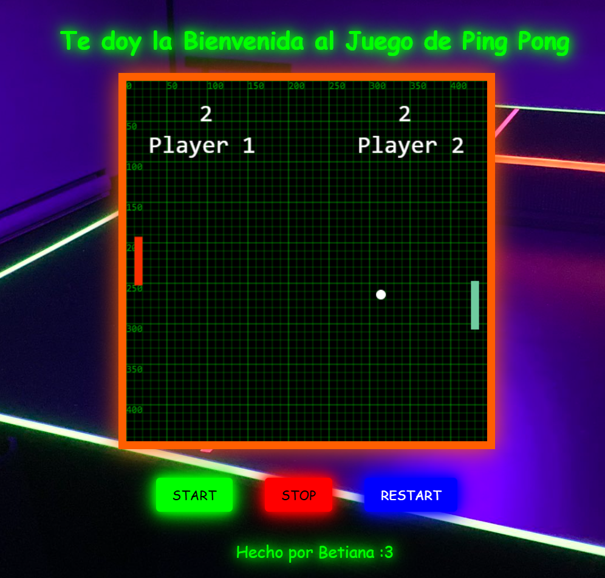

# 🎮 Ping Pong Game

Proyecto de Juego de Ping Pong desarrollado como propuesta de trabajo final para el curso de Programación Creativa con JavaScript en Aiko Academy.

## Descripción
Este es un juego de Ping Pong donde dos jugadores pueden competir entre sí. El juego incluye sonidos para las colisiones y una animación para el borde del canvas.

## Tecnologías Utilizadas
- HTML5
- CSS3
- JavaScript
- Tone.js

## Instalación
1. Clona el repositorio:
   ```sh
   git clone https://github.com/tu-usuario/ping-pong-game.git

2. Navega al directorio del proyecto:
	cd ping-pong-game/proyecto

3. Abre index.html en tu navegador preferido.


## Captura de Pantalla



## 🕹️ Cómo Jugar
##### Jugador 1: Usa las teclas de flecha arriba y abajo para mover la paleta roja.
##### Jugador 2: Usa el ratón para mover la paleta verde.
###### Botones:
###### 🟩 Start: Inicia el juego.
###### 🟥 Stop: Detiene el juego.
###### 🟦 Restart: Reinicia el juego y los puntajes.

## Créditos
Este proyecto fue creado como propuesta de trabajo final del curso de Programación Creativa con JavaScript en Aiko Academy. Agradezco a Aiko Academy y al profesor Anderson Josue Oroya Silva por la oportunidad de aprender a desarrollar este juego.

### Autor
Betiana Ramírez

